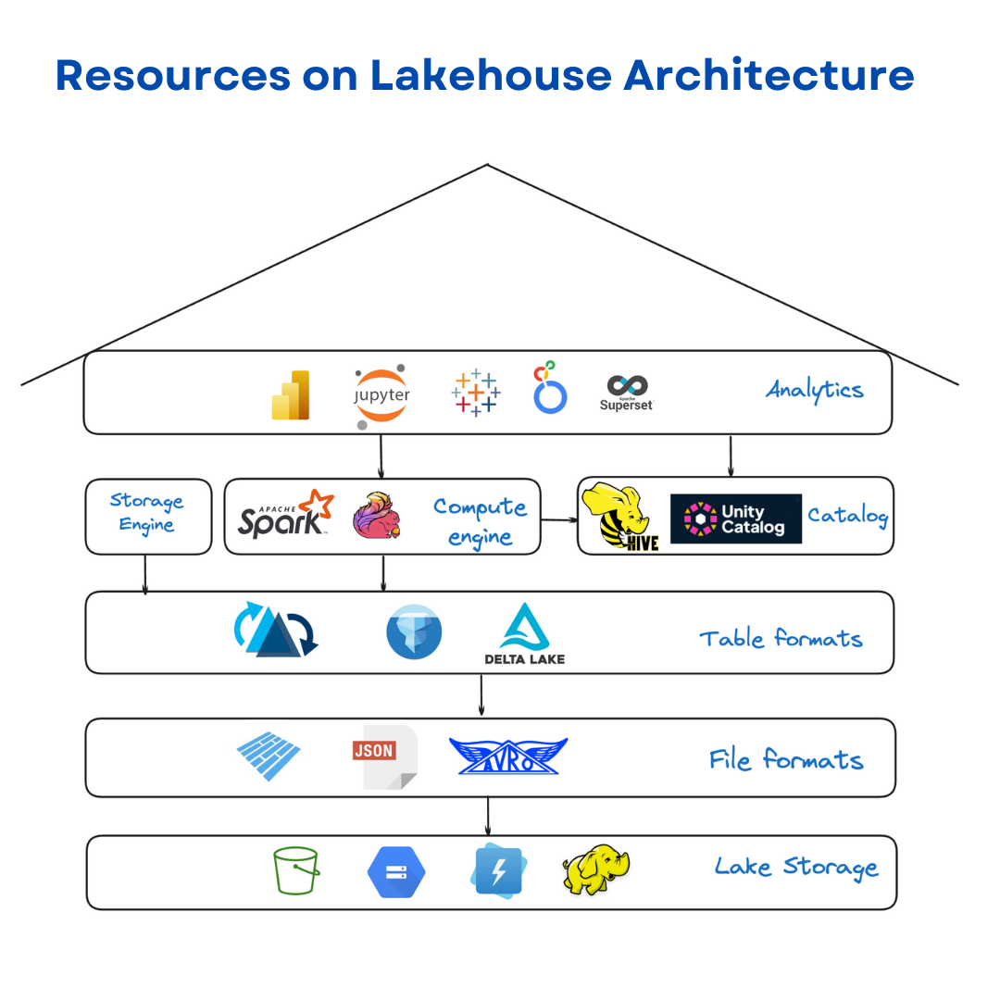

# awesome-lakehouse-guide
----------------------------------------

## Research Papers - Data Engineering (Lakehouse, Distributed Systems, Open Source)

<table>
  <tr>
    <th>Paper Name</th>
    <th>Area</th>
    <th>Quick Summary</th>
  </tr>
  <tr>
    <td><a href="https://www.cs.cit.tum.de/fileadmin/w00cfj/dis/papers/btrblocks.pdf" target="_blank">BtrBlocks</a></td>
    <td>File Format</td>
    <td>BtrBlocks introduces an efficient columnar storage format aimed at optimizing compression and decompression for data lakes, particularly when dealing with large datasets in cloud environments. The paper highlights how BtrBlocks outperforms traditional formats like Apache Parquet in both compression ratio and decompression speed. By using a combination of lightweight encoding schemes and a novel floating-point compression method called `Pseudodecimal Encoding`, BtrBlocks achieves significant improvements in scan performance, making it particularly useful for cloud-native systems that rely on high-throughput network environments like AWS S3. Key benefits include a 2.2x increase in scan speed and a 1.8x reduction in costs when compared to Parquet</td>
  </tr>
  <tr>
    <td><a href="https://arxiv.org/abs/2310.08697" target="_blank">The Data Lakehouse: Data Warehousing & More</a></td>
    <td>Lakehouse</td>
    <td>This paper discusses the evolution of data systems, focusing on the Data Lakehouse architecture. The authors explain how traditional RDBMS-OLAP systems, foundational for data warehousing, face challenges due to their rigid architecture and limitations in handling diverse analytical workloads. The Data Lakehouse architecture addresses these shortcomings by combining the strengths of data lakes (scalable storage for diverse data types) and data warehouses (efficient query performance and ACID transactions). Overall, the paper provides side-by-side comparisons of a data lakehouse and warehouse.</td>
  </tr>
  <tr>
    <td><a href="https://www.cidrdb.org/cidr2021/papers/cidr2021_paper17.pdf" target="_blank">Lakehouse: A New Generation of Open Platforms that Unify Data Warehousing and Advanced Analytics</a></td>
    <td>Lakehouse</td>
    <td>This paper introduces the Lakehouse architecture as a next-generation data management platform designed to unify the benefits of data lakes and data warehouses. Traditional data architectures often face challenges related to data complexity, delayed processing, and the high costs of managing separate lake and warehouse environments. The Lakehouse concept addresses these issues by enabling low-cost storage with ACID transactional capabilities, data versioning, and SQL performance similar to data warehouses.</td>
  </tr>
    <tr>
    <td><a href="https://www.amazon.science/publications/the-story-of-aws-glue" target="_blank">The Story of AWS Glue</a></td>
    <td>Data Tools</td>
    <td>AWS Glue is a serverless data integration service that simplifies the extraction, transformation, and loading (ETL) of data across various sources. Initially designed for batch ETL jobs, AWS Glue has evolved into a more versatile tool, supporting interactive debugging and dynamic scaling, making it suitable for a wide range of data processing tasks. One of its key components is the AWS Glue Data Catalog, which serves as a scalable metadata service, allowing users to store datasets from various sources. The paper details the architectural evolution of AWS Glue over six years, including lessons learned from customer use cases such as loading data warehouses, integrating on-premises databases, and ingesting streaming data. </td>
  </tr>
  <tr>
    <td><a href="https://www.amazon.science/publications/auto-wlm-machine-learning-enhanced-workload-management-in-amazon-redshift" target="_blank">Auto-WLM: Machine learning enhanced workload management in Amazon Redshift</a></td>
    <td>Data Tools</td>
    <td>This paper explores Auto-WLM (Automatic Workload Management), which is a machine learning-based system used in Amazon Redshift to manage and optimize query workloads efficiently. Traditional workload management systems rely on static configurations and manual tuning, but Auto-WLM introduces an intelligent, automated approach that adjusts resources dynamically based on real-time conditions. This capability has been implemented in production, showing improvements in query throughput and resource utilization, particularly under complex and mixed workload scenarios. </td>
  </tr>
  <tr>
    <td><a href="https://www.vldb.org/pvldb/vol16/p3044-liu.pdf" target="_blank">A Deep Dive into Common Open Formats for Analytical DBMSs</a></td>
    <td>File Format</td>
    <td>This paper evaluates the suitability of open columnar storage formats—Apache Arrow, Parquet, and ORC—for analytical database management systems (DBMSs). It provides an in-depth analysis of the encoding techniques, compression methods, and performance trade-offs associated with these formats. Key insights include comparisons between various encoding methods such as Bit-Packed Encoding (BP), Dictionary Encoding (DICT), and Run-Length Encoding (RLE). The paper emphasizes the trade-offs between space efficiency and query performance across these formats, providing guidance on selecting the right format for different analytical workloads.</td>
  </tr>
  <tr>
    <td><a href="https://arxiv.org/pdf/2401.09621" target="_blank">XTABLE in Action: Seamless Interoperability in Data Lakes</a></td>
    <td>Storage</td>
    <td>The paper introduces XTable, a solution designed to enhance interoperability between open table formats (LSTs) like Delta Lake, Apache Hudi, and Apache Iceberg in data lakes. XTable facilitates seamless data translation without rewriting tables, allowing data stored in one format to be accessible in others without costly migrations. The paper goes over the internal architecture of XTable and presents some real-world applications.</td>
  </tr>
  <tr>
    <td><a href="https://asterios.katsifodimos.com/assets/publications/flink-deb.pdf" target="_blank">Apache FlinkTM: Stream and Batch Processing in a Single Engine</a></td>
    <td>Compute Engine</td>
    <td>The paper explores Apache Flink, an open-source stream and batch processing engine. Flink provides a unified system to handle real-time data streams and batch data processing. The core of Flink's architecture is a distributed dataflow engine that enables scalable, fault-tolerant, and low-latency processing of large datasets. Key capabilities include state management, event time processing, and exactly-once semantics. The paper goes over Flink's application to workloads such as real-time analytics, machine learning, and ETL pipelines</td>
  </tr>
    <tr>
    <td><a href="https://www.amazon.science/publications/automated-multidimensional-data-layouts-in-amazon-redshift" target="_blank">Automated multidimensional data layouts in Amazon Redshift</a></td>
    <td>Storage</td>
    <td>This paper explores the introduction of Multidimensional Data Layouts (MDDL) in Amazon Redshift, which enhances query performance by automatically optimizing the physical data layout. Traditional data layout techniques, such as single-column and compound sort keys, are effective for some queries but struggle with multi-column filtering. MDDL improves upon this by dynamically organizing data across multiple dimensions, allowing for more efficient data pruning and skipping. The paper claims that this layout achieves up to 85% reduction in workload runtime and up to 100× faster performance on specific queries</td>
  </tr>
   <tr>
    <td><a href="https://research.google/pubs/vortex-a-stream-oriented-storage-engine-for-big-data-analytics/" target="_blank">Vortex: A Stream-oriented Storage Engine For Big Data Analytics</a></td>
    <td>Storage</td>
    <td>The paper presents Vortex, a storage engine developed within Google BigQuery to support real-time and batch data analytics. Vortex operates as a stream-first system, capable of handling both types of workloads efficiently, addressing the challenges of managing petabyte-scale data ingestion and processing. It achieves sub-second data freshness and low-latency query performance. Vortex integrates with BigQuery's distributed query engine, Dremel, and leverages Google's Colossus file system for robust, disaster-resilient storage.</td>
  </tr>
   <tr>
    <td><a href="https://vldb.org/pvldb/vol17/p4159-okolnychyi.pdf" target="_blank">Petabyte-Scale Row-Level Operations in Data Lakehouses</a></td>
    <td>Storage</td>
    <td>The paper introduces efficient row-level operations in data lakehouses using Apache Iceberg and Spark. It optimizes dense and sparse modifications with techniques like file materialization, delete markers, partitioned joins, and adaptive writes, achieving up to 10x performance improvements.</td>
  </tr>
</table>

---
## Blogs

<table>
  <tr>
    <th>Blog Title</th>
    <th>Tags</th>
    <th>Quick Summary</th>
  </tr>
   <tr>
    <td><a href="https://www.onehouse.ai/blog/open-table-formats-and-the-open-data-lakehouse-in-perspective" target="_blank">Open Table Formats and the Open Data Lakehouse, In Perspective</a></td>
    <td><code>Apache Hudi</code>, <code>Apache Iceberg</code>, <code>Delta Lake</code></td>
    <td>Explores the evolution of data architecture over the years, breaks down the lakehouse architecture into its components, and performs comparative analysis to distinguish between what exactly qualifies as open and what does not.</td>
  </tr>
  <tr>
    <td><a href="https://www.onehouse.ai/blog/how-to-optimize-performance-for-your-open-data-lakehouse" target="_blank">How to Optimize Performance for Your Open Data Lakehouse</a></td>
    <td><code>Apache Hudi</code>, <code>Apache Iceberg</code>, <code>Optimization</code></td>
    <td>This blog goes over the various storage & compute optimization techniques for lakehouse table formats.</td>
  </tr>
  <tr>
    <td><a href="https://www.dremio.com/blog/getting-started-with-flink-sql-and-apache-iceberg/" target="_blank">Getting Started with Flink SQL and Apache Iceberg</a></td>
    <td><code>Apache Iceberg</code>, <code>Flink</code></td>
    <td>How to get started with Flink SQL and Apache Iceberg for real-time processing.</td>
  </tr>
  <tr>
    <td><a href="https://dipankar-tnt.medium.com/apache-hudi-part-1-history-getting-started-95030b003759" target="_blank">Apache Hudi (Part 1): History, Getting Started</a></td>
    <td><code>Apache Hudi</code></td>
    <td>Discusses the motivations behind Apache Hudi (from its inception at `Uber`) and provides insights on the various ways to learn Hudi.</td>
  </tr>
  <tr>
    <td><a href="https://www.dremio.com/blog/how-z-ordering-in-apache-iceberg-helps-improve-performance/" target="_blank">How Z-Ordering in Apache Iceberg Helps Improve Performance</a></td>
    <td><code>Apache Iceberg</code>, <code>Optimization</code></td>
    <td>Explains how Z-ordering optimizes query performance by clustering data across multiple dimensions, reducing the need to scan unnecessary files. Although the blog is centered around Apache Iceberg, the concepts applies to other formats as well.</td>
  </tr>
   <tr>
    <td><a href="https://dipankar-tnt.medium.com/onetable-interoperability-for-apache-hudi-iceberg-delta-lake-bb8b27dd288d" target="_blank">What is Apache XTable — Interoperability for Apache Hudi, Iceberg & Delta Lake</a></td>
    <td><code>Apache Iceberg</code>, <code>Apache Hudi</code>, <code>Delta Lake</code>, <code>Interoperability</code></td>
    <td>The blog discusses Apache XTable, a framework designed to enable seamless interoperability between Apache Hudi, Apache Iceberg, and Delta Lake, allowing users to manage data across these open table formats with a unified approach</td>
  </tr>
    </tr>
   <tr>
    <td><a href="https://medium.com/apache-hudi-blogs/building-analytical-apps-on-the-lakehouse-using-apache-hudi-daft-streamlit-3224766fe58a" target="_blank">Building Analytical Apps on the Lakehouse using Apache Hudi, Daft & Streamlit</a>   </td>
    <td><code>Apache Hudi</code>, <code>Daft</code>, <code>Streamlit</code></td>
    <td>Shows hands-on examples of building data applications (dashboards) directly on top of an open lakehouse platform, using Apache Hudi, Daft, and Streamlit to enable seamless data visualization and exploration</td>
  </tr>
  <tr>
    <td><a href="https://www.dremio.com/blog/streamlining-data-quality-in-apache-iceberg-with-write-audit-publish-branching/" target="_blank">Streamlining Data Quality in Apache Iceberg with write-audit-publish & branching</a></td>
    <td><code>Apache Iceberg</code>, <code>Data Quality</code></td>
    <td>Explains how Apache Iceberg's Write-Audit-Publish (WAP) pattern, especially with its branching feature, enables efficient data quality checks. This approach allows data to be staged, audited, and then published only if it meets quality standards, isolating experimental data from production while leveraging branch-specific snapshots.</td>
  </tr>
  <tr>
    <td><a href="https://hudi.apache.org/blog/2024/07/11/what-is-a-data-lakehouse" target="_blank">What is a Data Lakehouse & How does it Work?</a></td>
    <td><code>Apache Hudi</code>, <code>Apache Iceberg</code>, <code>Delta Lake</code>, <code>Lakehouse</code></td>
    <td>An introductory blog on the Lakehouse architecture. Explains how this architecture merges the scalability and cost benefits of data lakes with the reliability and ACID transactional support of data warehouses.</td>
  </tr>
   <tr>
    <td><a href="https://www.dremio.com/blog/puffins-and-icebergs-additional-stats-for-apache-iceberg-tables/" target="_blank">Puffins and Icebergs: Additional Stats for Apache Iceberg Tables</a></td>
    <td><code>Apache Iceberg</code>, <code>Stochastic streaming</code></td>
    <td>Introduces the Puffin format in Apache Iceberg, designed to enhance data query efficiency by storing additional statistics and secondary indexes. Puffin allows metadata enrichment for better query planning, with one use case being the ability to store approximate distinct counts (NDV) using data sketches.</td>
  </tr>
   <tr>
    <td><a href="https://dipankar-tnt.medium.com/using-apache-hudi-iceberg-tables-in-databricks-with-apache-xtable-253f411be637" target="_blank">Using Apache Hudi & Iceberg tables in Databricks with Apache XTable</a></td>
    <td><code>Apache Iceberg</code>, <code>Apache Hudi</code>, <code>Databricks</code></td>
    <td>This blog post provides a practical example of how to use Apache XTable to achieve interoperability between Apache Hudi, Iceberg, and Delta Lake formats to build workflows in Databricks.</td>
  </tr>
     <tr>
    <td><a href="https://www.onehouse.ai/blog/open-table-formats-and-the-open-data-lakehouse-in-perspective" target="_blank">Open Table Formats and the Open Data Lakehouse, In Perspective</a></td>
    <td><code>Apache Hudi</code>, <code>Apache Iceberg</code>, <code>Lakehouse</code></td>
    <td>The blog argues that while open table formats are intended to make data architectures more open and interoperable, organizations often remain constrained by proprietary tools and table services for essential functions, preventing a fully open data architecture.</td>
  </tr>
   <tr>
    <td><a href="https://medium.com/@dipankar-tnt/hudi-rs-with-duckdb-polars-daft-datafusion-single-node-lakehouse-347ee1a45371" target="_blank">Hudi-rs with DuckDB, Polars, Daft, DataFusion — Single-node Lakehouse</a></td>
    <td><code>Apache Hudi</code>, <code>DuckDB</code>, <code>Apache DataFusion</code>, <code>Daft</code></td>
    <td> The blog demonstrates how to use Apache Hudi with Rust-based libraries like DuckDB, Polars, Daft, and DataFusion to build a single-node lakehouse without relying on JVM or Spark dependencies, enabling efficient data processing within a Python ecosystem.</td>
  </tr>
  <tr>
    <td><a href="Ultimate Directory of Apache Iceberg Resources" target="_blank">Ultimate Directory of Apache Iceberg Resources</a></td>
    <td><code>Apache Iceberg</code></td>
    <td> This blog is directory of resources for learning about the Apache Iceberg Format</td>
  </tr>
  <tr>
    <td><a href="https://amdatalakehouse.substack.com/p/virtualization-lakehouse-mesh-data" target="_blank">Virtualization + Lakehouse + Mesh = Data At Scale</a></td>
    <td><code>Data Lakehouse</code>, <code>Virtualization</code>, <code>Data Mesh</code></td>
    <td> This article explains why virtualization, lakehouse and mesh are complimentary trends.</td>
  </tr>
  <tr>
    <td><a href="https://amdatalakehouse.substack.com/p/hands-on-with-apache-iceberg-on-your" target="_blank">Hands-on with Apache Iceberg on Your Laptop</a></td>
    <td><code>Apache Iceberg</code></td>
    <td> This blog is an end to end walkthrough on your laptop of ingesting data from Spark, running analytics with Dremio and creating a visualizations in a notebook with Polars & Seaborn using the Apache Iceberg table format.</td>
  </tr>
  <tr>
    <td><a href="https://www.onehouse.ai/blog/comprehensive-data-catalog-comparison" target="_blank">Comprehensive Data Catalog Comparison</a></td>
    <td><code>Unity</code>, <code>Polaris</code>, <code>DataHub</code></td>
    <td>A comparison blog for different data catalogs in the lakehouse space.</td>
  </tr>
  <tr>
    <td><a href="https://jack-vanlightly.com/blog/2024/9/19/table-format-comparisons-change-queries-and-cdc" target="_blank">Table format comparisons - Change queries and CDC</a></td>
    <td><code>Apache Icebergy</code>, <code>Delta Lake</code>, <code>Apache Hudi</code>, <code>Apache Paimon</code></td>
    <td>How changes made to an Iceberg/Delta/Hudi/Paimon table can be emitted as a stream of changes. In the context of the table formats, is the capability to incrementally consume changes by performing periodic change queries.</td>
  </tr>
  <tr>
    <td><a href="https://www.guptaakashdeep.com/copy-on-write-or-merge-on-read-apache-iceberg-2/" target="_blank">Copy-on-Write or Merge-on-Read? -- What, When and How?</a></td>
    <td><code>Apache Icebergy</code></td>
    <td>This blog explains what are Copy-on-Write and Merge-on-Read using Apache Iceberg Table Format, how these can help in improving the Row-level updates, what are Positional and Equality Delete files, and when to use which approach along with in detailed hands on code.</td>
  </tr>

</table>

---
## Code/Notebooks

<table>
  <tr>
    <th>Description</th>
    <th>Tags</th>
  </tr>
  <tr>
    <td><a href="https://github.com/dipankarmazumdar/HudiCodeExamples/blob/main/Hudi_S3_SparkSQL.ipynb" target="_blank">Creating Hudi Tables on Amazon S3 using Spark SQL.</a></td>
    <td><code>Apache Hudi</code></td>
  </tr>
 <tr>
    <td><a href="https://github.com/dipankarmazumdar/HudiCodeExamples/blob/main/Hudi_Clustering_Spark_SQL.ipynb" target="_blank">Running Inline Clustering in Apache Hudi.</a></td>
    <td><code>Apache Hudi</code></td>
  </tr>
  <tr>
    <td><a href="https://github.com/dipankarmazumdar/Iceberg_Usecases/blob/main/notebooks/Spark_iceberg.ipynb" target="_blank">Creating Iceberg Tables on Amazon S3 using Spark.</a></td>
    <td><code>Apache Iceberg</code></td>
  </tr>
  <tr>
    <td><a href="https://github.com/dipankarmazumdar/Iceberg_Usecases/blob/main/notebooks/CDC_iceberg.ipynb" target="_blank">Implementing CDC use cases in Apache Iceberg.</a></td>
    <td><code>Apache Iceberg</code></td>
  </tr>
  <tr>
    <td><a href="https://github.com/developer-advocacy-dremio/dremio-compose" target="_blank">Lakehouse on your Laptop Docker Compose Examples</a></td>
    <td><code>Apache Iceberg</code></td>
  </tr>
  <tr>
    <td><a href="https://github.com/guptaakashdeep/WAP-implementation/tree/main" target="_blank">Implementing Write-Audit-Publish DQ Pattern using Iceberg Branches and WAP ID with Spark on AWS</a></td>
    <td><code>Apache Iceberg</code></td>
  </tr>
</table>

