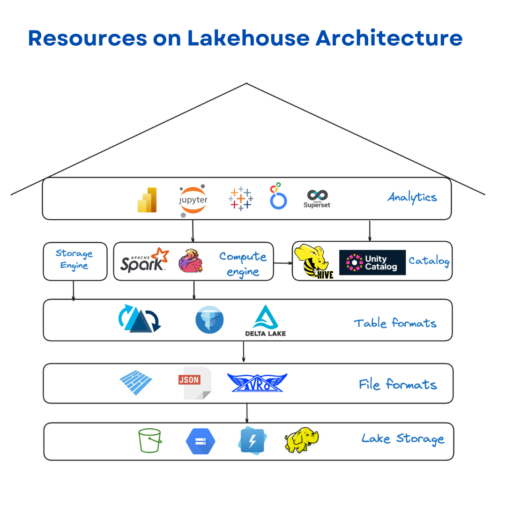

# Awesome Lakehouse Guide

A curated guide to open table formats—Apache Iceberg, Apache Hudi, and Delta Lake—and the broader data lakehouse architecture.

  

Browse first by resource type, then by topic:

- [Research papers](#research-papers)
- [Blogs](#blogs)
- [Code and notebooks](#code-and-notebooks)
- [LinkedIn posts](#linkedin-posts)

## Research papers

### Lakehouse foundations

| Paper | Quick summary |
| --- | --- |
| [The Data Lakehouse: Data Warehousing & More](https://arxiv.org/abs/2310.08697) | Lakehouse | This paper discusses the evolution of data systems, focusing on the Data Lakehouse architecture. The authors explain how traditional RDBMS-OLAP systems, foundational for data warehousing, face challenges due to their rigid architecture and limitations in handling diverse analytical workloads. The Data Lakehouse architecture addresses these shortcomings by combining the strengths of data lakes (scalable storage for diverse data types) and data warehouses (efficient query performance and ACID transactions). Overall, the paper provides side-by-side comparisons of a data lakehouse and warehouse. |
| [Lakehouse: A New Generation of Open Platforms that Unify Data Warehousing and Advanced Analytics](https://www.cidrdb.org/cidr2021/papers/cidr2021_paper17.pdf) | Lakehouse | This paper introduces the Lakehouse architecture as a next-generation data management platform designed to unify the benefits of data lakes and data warehouses. Traditional data architectures often face challenges related to data complexity, delayed processing, and the high costs of managing separate lake and warehouse environments. The Lakehouse concept addresses these issues by enabling low-cost storage with ACID transactional capabilities, data versioning, and SQL performance similar to data warehouses. |

### File formats and storage

| Paper | Quick summary |
| --- | --- |
| [BtrBlocks](https://www.cs.cit.tum.de/fileadmin/w00cfj/dis/papers/btrblocks.pdf) | File Format | BtrBlocks introduces an efficient columnar storage format aimed at optimizing compression and decompression for data lakes, particularly when dealing with large datasets in cloud environments. The paper highlights how BtrBlocks outperforms traditional formats like Apache Parquet in both compression ratio and decompression speed. By using a combination of lightweight encoding schemes and a novel floating-point compression method called `Pseudodecimal Encoding`, BtrBlocks achieves significant improvements in scan performance, making it particularly useful for cloud-native systems that rely on high-throughput network environments like AWS S3. Key benefits include a 2.2x increase in scan speed and a 1.8x reduction in costs when compared to Parquet |
| [A Deep Dive into Common Open Formats for Analytical DBMSs](https://www.vldb.org/pvldb/vol16/p3044-liu.pdf) | File Format | This paper evaluates the suitability of open columnar storage formats—Apache Arrow, Parquet, and ORC—for analytical database management systems (DBMSs). It provides an in-depth analysis of the encoding techniques, compression methods, and performance trade-offs associated with these formats. Key insights include comparisons between various encoding methods such as Bit-Packed Encoding (BP), Dictionary Encoding (DICT), and Run-Length Encoding (RLE). The paper emphasizes the trade-offs between space efficiency and query performance across these formats, providing guidance on selecting the right format for different analytical workloads. |
| [Automated multidimensional data layouts in Amazon Redshift](https://www.amazon.science/publications/automated-multidimensional-data-layouts-in-amazon-redshift) | Storage | This paper explores the introduction of Multidimensional Data Layouts (MDDL) in Amazon Redshift, which enhances query performance by automatically optimizing the physical data layout. Traditional data layout techniques, such as single-column and compound sort keys, are effective for some queries but struggle with multi-column filtering. MDDL improves upon this by dynamically organizing data across multiple dimensions, allowing for more efficient data pruning and skipping. The paper claims that this layout achieves up to 85% reduction in workload runtime and up to 100× faster performance on specific queries |
| [Vortex: A Stream-oriented Storage Engine For Big Data Analytics](https://research.google/pubs/vortex-a-stream-oriented-storage-engine-for-big-data-analytics/) | Storage | The paper presents Vortex, a storage engine developed within Google BigQuery to support real-time and batch data analytics. Vortex operates as a stream-first system, capable of handling both types of workloads efficiently, addressing the challenges of managing petabyte-scale data ingestion and processing. It achieves sub-second data freshness and low-latency query performance. Vortex integrates with BigQuery's distributed query engine, Dremel, and leverages Google's Colossus file system for robust, disaster-resilient storage. |
| [Data page layouts for relational databases on deep memory hierarchies](https://dl.acm.org/doi/pdf/10.1007/s00778-002-0074-9) | Storage | The paper introduce and evaluate PAX (Partition Attributes Across) Storage Model. PAX is the foundation how Open Stoage Formats like Parquet, ORC stores data internally. It dicusses the origin and need of PAX and how it combines the best of both the Row Storage Model (NSM: N-Ary Storage Model) and Columnar Storage Model (DSM: Decomposition Storage Model). It also explains how PAX results in higher cache hit rates and better memory bandwith utilization. |
| [An Empirical Evaluation of Columnar Storage Formats](https://www.vldb.org/pvldb/vol17/p148-zeng.pdf) | Storage | This paper conducts a modern benchmark of the two most popular open-source columnar formats—Parquet and ORC—evaluating their performance and storage efficiency on real-world and ML workloads. Their findings include the benefits of default dictionary encoding, prioritizing decoding speed over maximum compression, and identifying inefficiencies in current designs when using GPUs or handling common machine learning tasks |

### Table formats and interoperability

| Paper | Quick summary |
| --- | --- |
| [XTABLE in Action: Seamless Interoperability in Data Lakes](https://arxiv.org/pdf/2401.09621) | Storage | The paper introduces XTable, a solution designed to enhance interoperability between open table formats (LSTs) like Delta Lake, Apache Hudi, and Apache Iceberg in data lakes. XTable facilitates seamless data translation without rewriting tables, allowing data stored in one format to be accessible in others without costly migrations. The paper goes over the internal architecture of XTable and presents some real-world applications. |
| [Petabyte-Scale Row-Level Operations in Data Lakehouses](https://vldb.org/pvldb/vol17/p4159-okolnychyi.pdf) | Storage | The paper introduces efficient row-level operations in data lakehouses using Apache Iceberg and Spark. It optimizes dense and sparse modifications with techniques like file materialization, delete markers, partitioned joins, and adaptive writes, achieving up to 10x performance improvements. |

### Compute, databases, and streaming

| Paper | Quick summary |
| --- | --- |
| [The Story of AWS Glue](https://www.amazon.science/publications/the-story-of-aws-glue) | Data Tools | AWS Glue is a serverless data integration service that simplifies the extraction, transformation, and loading (ETL) of data across various sources. Initially designed for batch ETL jobs, AWS Glue has evolved into a more versatile tool, supporting interactive debugging and dynamic scaling, making it suitable for a wide range of data processing tasks. One of its key components is the AWS Glue Data Catalog, which serves as a scalable metadata service, allowing users to store datasets from various sources. The paper details the architectural evolution of AWS Glue over six years, including lessons learned from customer use cases such as loading data warehouses, integrating on-premises databases, and ingesting streaming data. |
| [Auto-WLM: Machine learning enhanced workload management in Amazon Redshift](https://www.amazon.science/publications/auto-wlm-machine-learning-enhanced-workload-management-in-amazon-redshift) | Data Tools | This paper explores Auto-WLM (Automatic Workload Management), which is a machine learning-based system used in Amazon Redshift to manage and optimize query workloads efficiently. Traditional workload management systems rely on static configurations and manual tuning, but Auto-WLM introduces an intelligent, automated approach that adjusts resources dynamically based on real-time conditions. This capability has been implemented in production, showing improvements in query throughput and resource utilization, particularly under complex and mixed workload scenarios. |
| [Apache FlinkTM: Stream and Batch Processing in a Single Engine](https://asterios.katsifodimos.com/assets/publications/flink-deb.pdf) | Compute Engine | The paper explores Apache Flink, an open-source stream and batch processing engine. Flink provides a unified system to handle real-time data streams and batch data processing. The core of Flink's architecture is a distributed dataflow engine that enables scalable, fault-tolerant, and low-latency processing of large datasets. Key capabilities include state management, event time processing, and exactly-once semantics. The paper goes over Flink's application to workloads such as real-time analytics, machine learning, and ETL pipelines |
| [Photon: A Fast Query Engine for Lakehouse Systems](https://people.eecs.berkeley.edu/~matei/papers/2022/sigmod_photon.pdf) | Compute Engine | The papers discusses the Databricks Photon: A Vectorized Query Execution Engine for Lakehouse Environment. It also discusses the design choices made in Photon (e.g., vectorization vs. code generation) and describe its integration with existing SQL and Apache Spark runtimes, its task model, and its memory manager. |
| [DuckDB: an Embeddable Analytical Database](https://duckdb.org/pdf/SIGMOD2019-demo-duckdb.pdf) | Storage | This paper introduces DuckDB, an embeddable, columnar analytical SQL database engine—think “SQLite for OLAP”—designed to run in-process, offering high-performance execution of complex analytical queries without a separate server. |
| [Ursa: A Lakehouse-Native Data Streaming Engine for Kafka](https://www.vldb.org/pvldb/vol18/p5184-guo.pdf) | Storage | Ursa introduces a leaderless, Kafka-compatible streaming engine that writes data directly into open tables like Apache Iceberg, Delta Lake on object storage, removing the need for connectors or staging systems. |
| [Disaggregated State Management in Flink 2.0](https://www.vldb.org/pvldb/vol18/p4846-mei.pdf) | Compute | Instead of binding compute tightly to local state, Flink 2.0 pushes primary state storage to distributed file systems (HDFS/S3) and uses local disk only as cache. That unlocks elastic scaling, lighter checkpoints, and much faster recovery. |
## Blogs

### Lakehouse foundations and architecture

| Blog | Tags | Quick summary |
| --- | --- | --- |
| [The AI-Powered Data Lakehouse](https://www.cloudera.com/blog/business/the-future-delivered-today-the-ai-powered-data-lakehouse.html) | `Apache Iceberg` | The blog highlights how an AI-powered data lakehouse unifies analytics and AI on one open, governed platform. By using open standards like Apache Iceberg, organizations can run BI, ML, and generative AI directly on their data across clouds without duplication. |
| [From BI to AI: A Modern Lakehouse Stack with Lance and Iceberg](https://lancedb.com/blog/from-bi-to-ai-lance-and-iceberg/) | `Apache Iceberg`, `Lance` | Iceberg powers reliable BI and analytics, while Lance is built for fast AI/ML and vector workloads—together they form a complementary lakehouse stack from BI to AI using Apache Iceberg and LanceDB. This blog goes all over this. |
| [DuckLake: SQL as a Lakehouse Format](https://ducklake.select/2025/05/27/ducklake-01/) | `DuckLake` | Introductory blog on how DuckLake simplifies lakehouses by using a standard SQL database for all metadata, instead of complex file-based systems, while still storing data in open formats like Parquet. |
| [What is a Data Lakehouse & How does it Work?](https://hudi.apache.org/blog/2024/07/11/what-is-a-data-lakehouse) | `Apache Hudi`, `Apache Iceberg`, `Delta Lake`, `Lakehouse` | An introductory blog on the Lakehouse architecture. Explains how this architecture merges the scalability and cost benefits of data lakes with the reliability and ACID transactional support of data warehouses. |
| [Virtualization + Lakehouse + Mesh = Data At Scale](https://amdatalakehouse.substack.com/p/virtualization-lakehouse-mesh-data) | `Data Lakehouse`, `Virtualization`, `Data Mesh` | This article explains why virtualization, lakehouse and mesh are complimentary trends. |

### Apache Iceberg

| Blog | Tags | Quick summary |
| --- | --- | --- |
| [Apache Iceberg: Key Innovations So Far and What’s Next for Developers in V4?](https://community.cloudera.com/t5/Developer-Blogs/Apache-Iceberg-Key-Innovations-So-Far-and-What-s-Next-for/ba-p/413024) | `Apache Iceberg` | The blog summarizes how Apache Iceberg has evolved with transactional guarantees, row-level updates, and advanced metadata features, and previews upcoming improvements to performance and flexibility that strengthen modern lakehouse architectures. |
| [From the trenches: Managing Apache Iceberg metadata for near-real-time workloads](https://www.onehouse.ai/blog/from-the-trenches-managing-apache-iceberg-metadata-for-near-real-time-workloads) | `Apache Hudi`, `Apache Iceberg`, `Apache XTable` | This blog goes into real-world challenges of using Apache Iceberg for near-real-time workloads - specifically how frequent writes lead to metadata bloat, slow snapshot expiration, and costly orphan-file cleanup—then outlines production-grade solutions like custom cleanup strategies and timeline-powered maintenance to keep SLAs intact. |
| [Getting Started with Flink SQL and Apache Iceberg](https://www.dremio.com/blog/getting-started-with-flink-sql-and-apache-iceberg/) | `Apache Iceberg`, `Flink` | How to get started with Flink SQL and Apache Iceberg for real-time processing. |
| [How Z-Ordering in Apache Iceberg Helps Improve Performance](https://www.dremio.com/blog/how-z-ordering-in-apache-iceberg-helps-improve-performance/) | `Apache Iceberg`, `Optimization` | Explains how Z-ordering optimizes query performance by clustering data across multiple dimensions, reducing the need to scan unnecessary files. Although the blog is centered around Apache Iceberg, the concepts applies to other formats as well. |
| [Streamlining Data Quality in Apache Iceberg with write-audit-publish & branching](https://www.dremio.com/blog/streamlining-data-quality-in-apache-iceberg-with-write-audit-publish-branching/) | `Apache Iceberg`, `Data Quality` | Explains how Apache Iceberg's Write-Audit-Publish (WAP) pattern, especially with its branching feature, enables efficient data quality checks. This approach allows data to be staged, audited, and then published only if it meets quality standards, isolating experimental data from production while leveraging branch-specific snapshots. |
| [Puffins and Icebergs: Additional Stats for Apache Iceberg Tables](https://www.dremio.com/blog/puffins-and-icebergs-additional-stats-for-apache-iceberg-tables/) | `Apache Iceberg`, `Statistics`, `Indexing` | Introduces the Puffin format in Apache Iceberg, designed to enhance data query efficiency by storing additional statistics and secondary indexes. Puffin allows metadata enrichment for better query planning, with one use case being the ability to store approximate distinct counts (NDV) using data sketches. |
| [Ultimate Directory of Apache Iceberg Resources](https://amdatalakehouse.substack.com/p/ultimate-directory-of-apache-iceberg) | `Apache Iceberg` | This blog is directory of resources for learning about the Apache Iceberg Format |
| [Hands-on with Apache Iceberg on Your Laptop](https://amdatalakehouse.substack.com/p/hands-on-with-apache-iceberg-on-your) | `Apache Iceberg` | This blog is an end to end walkthrough on your laptop of ingesting data from Spark, running analytics with Dremio and creating a visualizations in a notebook with Polars & Seaborn using the Apache Iceberg table format. |
| [Copy-on-Write or Merge-on-Read? -- What, When and How?](https://www.guptaakashdeep.com/copy-on-write-or-merge-on-read-apache-iceberg-2/) | `Apache Iceberg` | This blog explains what are Copy-on-Write and Merge-on-Read using Apache Iceberg Table Format, how these can help in improving the Row-level updates, what are Positional and Equality Delete files, and when to use which approach along with in detailed hands on code. |

### Apache Hudi

| Blog | Tags | Quick summary |
| --- | --- | --- |
| [Powering Amazon Unit Economics at Scale Using Apache Hudi](https://hudi.apache.org/blog/2025/03/31/amazon-hudi/) | `Apache Hudi`, `Amazon`, `Use Case` | Amazon’s Profit Intelligence team built Nexus, a configuration-driven platform powered by Apache Hudi, to scale unit economics across thousands of retail use cases. This blog dives into their data lakehouse journey. |
| [Introducing Secondary Index in Apache Hudi Lakehouse Platform](https://hudi.apache.org/blog/2025/04/02/secondary-index/) | `Apache Hudi`, `Index`, `Performance` | The blog introduces the new secondary index feature in Apache Hudi and how it enhances Hudi's capabilities as a high-performance lakehouse platform. |
| [Apache Hudi (Part 1): History, Getting Started](https://dipankar-tnt.medium.com/apache-hudi-part-1-history-getting-started-95030b003759) | `Apache Hudi` | Discusses the motivations behind Apache Hudi (from its inception at `Uber`) and provides insights on the various ways to learn Hudi. |
| [Building Analytical Apps on the Lakehouse using Apache Hudi, Daft & Streamlit](https://medium.com/apache-hudi-blogs/building-analytical-apps-on-the-lakehouse-using-apache-hudi-daft-streamlit-3224766fe58a) | `Apache Hudi`, `Daft`, `Streamlit` | Shows hands-on examples of building data applications (dashboards) directly on top of an open lakehouse platform, using Apache Hudi, Daft, and Streamlit to enable seamless data visualization and exploration |
| [Hudi-rs with DuckDB, Polars, Daft, DataFusion — Single-node Lakehouse](https://medium.com/@dipankar-tnt/hudi-rs-with-duckdb-polars-daft-datafusion-single-node-lakehouse-347ee1a45371) | `Apache Hudi`, `DuckDB`, `Apache DataFusion`, `Daft` | The blog demonstrates how to use Apache Hudi with Rust-based libraries like DuckDB, Polars, Daft, and DataFusion to build a single-node lakehouse without relying on JVM or Spark dependencies, enabling efficient data processing within a Python ecosystem. |

### Open table formats and interoperability

| Blog | Tags | Quick summary |
| --- | --- | --- |
| [Towards Open Data - Part 1: Cloud Warehouses Now Love Open Formats](https://www.onehouse.ai/blog/towards-open-data---part-1-cloud-warehouses-now-love-open-formats) | `Apache Hudi`, `Apache Iceberg`, `Delta Lake`, `Snowflake`, `Redshift`, `BigQuery` | This blog highlights that cloud data warehouses like Snowflake, Redshift, and BigQuery have recently begun supporting open table formats (Iceberg, Hudi, Delta) via external tables and managed offerings—but current implementations remain far from fully “open.”. |
| [Concurrency Control in Open Data Lakehouse](https://hudi.apache.org/blog/2025/01/28/concurrency-control/) | `Apache Hudi`, `Apache Iceberg`, `Delta Lake` | This blog goes into the fundamentals of concurrency control, explores why it is essential for lakehouses, and examines how open table formats such as Apache Hudi enable strong concurrency control mechanisms to uphold the ACID properties. |
| [Data Deduplication Strategies in an Open Lakehouse Architecture](https://www.onehouse.ai/blog/data-deduplication-strategies-in-an-open-lakehouse-architecture) | `Apache Hudi`, `Apache Iceberg`, `Delta Lake` | Understand how duplication occurs across ingestion, storage merging, and table management in lakehouse architectures, and explore the native deduplication strategies offered by open table formats like Apache Hudi. |
| [ACID Transactions in an Open Data Lakehouse](https://www.onehouse.ai/blog/acid-transactions-in-an-open-data-lakehouse) | `Apache Hudi`, `Apache Iceberg`, `Delta Lake` | This blog explains the fundamentals of ACID transactions and how each open table format implements them for lakehouse. |
| [What is Clustering in an Open Data Lakehouse?](https://www.onehouse.ai/blog/what-is-clustering-in-an-open-data-lakehouse) | `Apache Hudi`, `Apache Iceberg`, `Delta Lake`, `Optimization` | Explores the different types of clustering algorithms in the context of lakehouse formats. |
| [How to Optimize Performance for Your Open Data Lakehouse](https://www.onehouse.ai/blog/how-to-optimize-performance-for-your-open-data-lakehouse) | `Apache Hudi`, `Apache Iceberg`, `Delta Lake`, `Optimization` | This blog goes over the five (5) optimization techniques applicable to lakehouse table formats. |
| [Open Table Formats and the Open Data Lakehouse, In Perspective](https://www.onehouse.ai/blog/open-table-formats-and-the-open-data-lakehouse-in-perspective) | `Apache Hudi`, `Apache Iceberg`, `Delta Lake` | Explores the evolution of data architecture over the years, breaks down the lakehouse architecture into its components, and performs comparative analysis to distinguish between what exactly qualifies as open and what does not. |
| [What is Apache XTable — Interoperability for Apache Hudi, Iceberg & Delta Lake](https://dipankar-tnt.medium.com/onetable-interoperability-for-apache-hudi-iceberg-delta-lake-bb8b27dd288d) | `Apache Iceberg`, `Apache Hudi`, `Delta Lake`, `Interoperability` | The blog discusses Apache XTable, a framework designed to enable seamless interoperability between Apache Hudi, Apache Iceberg, and Delta Lake, allowing users to manage data across these open table formats with a unified approach |
| [Using Apache Hudi & Iceberg tables in Databricks with Apache XTable](https://dipankar-tnt.medium.com/using-apache-hudi-iceberg-tables-in-databricks-with-apache-xtable-253f411be637) | `Apache Iceberg`, `Apache Hudi`, `Databricks` | This blog post provides a practical example of how to use Apache XTable to achieve interoperability between Apache Hudi, Iceberg, and Delta Lake formats to build workflows in Databricks. |
| [Table format comparisons - Change queries and CDC](https://jack-vanlightly.com/blog/2024/9/19/table-format-comparisons-change-queries-and-cdc) | `Apache Iceberg`, `Delta Lake`, `Apache Hudi`, `Apache Paimon` | How changes made to an Iceberg/Delta/Hudi/Paimon table can be emitted as a stream of changes. In the context of the table formats, is the capability to incrementally consume changes by performing periodic change queries. |

### File formats and data access

| Blog | Tags | Quick summary |
| --- | --- | --- |
| [Apache Parquet vs. Newer File Formats (BtrBlocks, FastLanes, Lance, Vortex)](https://dipankar-tnt.medium.com/apache-parquet-vs-newer-file-formats-btrblocks-fastlanes-lance-vortex-cdf02130182c) | `Apache Parquet`, `Lance` | The blog compares Apache Parquet with newer file formats like Lance, FastLanes, BtrBlocks, and Vortex, highlighting how these modern formats address Parquet’s performance and access limitations in AI, ML, and vector-driven workloads. |
| [What is Apache Arrow Flight, Flight SQL & ADBC?](https://dipankar-tnt.medium.com/what-is-apache-arrow-flight-flight-sql-adbc-a076511122ac) | `Apache Arrow` | The blog explains how Apache Arrow Flight enables high-performance columnar data transport, Arrow Flight SQL brings SQL access to that protocol, and Arrow Database Connectivity (ADBC) offers a unified API for Arrow-native database interactions, collectively reducing inefficiencies of legacy row-based protocols |

### Catalogs and metadata

| Blog | Tags | Quick summary |
| --- | --- | --- |
| [The Architecture of Apache Polaris - Under the Hood](https://community.cloudera.com/t5/Developer-Blogs/The-Architecture-of-Apache-Polaris-Under-the-Hood/ba-p/414066) | `Apache Iceberg`, `Apache Polaris` | Understand Apache Polaris Internals from a Systems Design Perspective. |
| [Comprehensive Data Catalog Comparison](https://www.onehouse.ai/blog/comprehensive-data-catalog-comparison) | `Unity Catalog`, `Apache Polaris`, `DataHub` | A comparison blog for different data catalogs in the lakehouse space. |

## Code and notebooks

### Apache Hudi

| Description | Tags |
| --- | --- |
| [Creating Hudi Tables on Amazon S3 using Spark SQL.](https://github.com/dipankarmazumdar/HudiCodeExamples/blob/main/Hudi_S3_SparkSQL.ipynb) | `Apache Hudi` |
| [Running Inline Clustering in Apache Hudi.](https://github.com/dipankarmazumdar/HudiCodeExamples/blob/main/Hudi_Clustering_Spark_SQL.ipynb) | `Apache Hudi` |

### Apache Iceberg

| Description | Tags |
| --- | --- |
| [Creating Iceberg Tables on Amazon S3 using Spark.](https://github.com/dipankarmazumdar/Iceberg_Usecases/blob/main/notebooks/Spark_iceberg.ipynb) | `Apache Iceberg` |
| [Implementing CDC use cases in Apache Iceberg.](https://github.com/dipankarmazumdar/Iceberg_Usecases/blob/main/notebooks/CDC_iceberg.ipynb) | `Apache Iceberg` |

## LinkedIn posts

<!-- LINKEDIN_POSTS_START -->
- [What is Apache Arrow? Origins + Design](https://www.linkedin.com/posts/dipankar-mazumdar_parquet-dataengineering-softwareengineering-activity-7339094877005086720-mI5f)
- [What is 'Vectorized Processing'?](https://www.linkedin.com/posts/dipankar-mazumdar_dataengineering-softwareengineering-activity-7340906100742836225-8fH2)
<!-- LINKEDIN_POSTS_END -->
